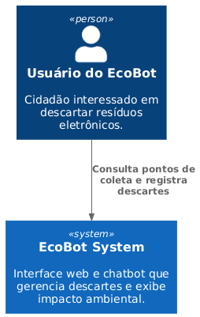
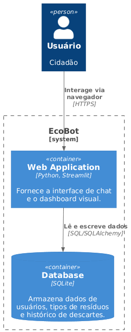

# Documentação de Arquitetura - EcoBot

Esta página descreve as escolhas tecnológicas e o projeto arquitetural da solução EcoBot.

## 1. Escolhas de Tecnologias

*   **Linguagem: Python 3.10+**: Escolhida pela vasta disponibilidade de bibliotecas para ciência de dados e integração de chatbots.
*   **Interface Web: Streamlit**: Framework que permite a criação de interfaces ricas em Python sem a necessidade de separação complexa entre frontend e backend, ideal para prototipação rápida e dashboards.
*   **Banco de Dados: SQLite**: Banco de dados relacional que não requer servidor (serverless), facilitando a portabilidade do projeto e a gerência de configuração (armazenado em arquivo local).
*   **Modelagem: C4 Model**: Utilizado para descrever a arquitetura de software de forma clara e em diferentes níveis de abstração.

## 2. Projeto Arquitetural (C4 Model)

O EcoBot segue uma arquitetura de **Aplicação Monolítica Simplificada**, onde a interface de usuário (Streamlit) e a lógica de negócios residem no mesmo contêiner, comunicando-se diretamente com o Banco de Dados SQLite.

### Nível 1: Contexto
O sistema EcoBot atua como o único ponto de contato para o usuário final realizar consultas e registros sobre sustentabilidade.

### Nível 2: Contêiner
A aplicação web processa as mensagens do chat e renderiza os gráficos do dashboard consultando o banco de dados local.

### Nível 1: Diagrama de Contexto

### Nível 2: Diagrama de Contêiner

## 3. Justificativa do Modelo

A escolha pelo C4 Model justifica-se pela sua capacidade de comunicar a arquitetura tanto para perfis técnicos quanto para stakeholders. O nível de Contêiner é especialmente útil para este projeto, pois explicita a dependência entre o script Python (Streamlit) e o arquivo de dados (SQLite), garantindo que a gerência de configuração contemple ambos. O modelo simplificado de contêiner único foi adotado para reduzir a latência de comunicação e facilitar o deploy da aplicação em ambientes de nuvem voltados para Python.
